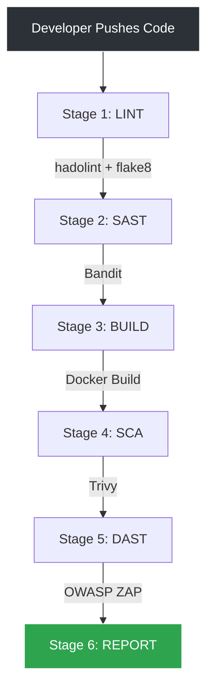
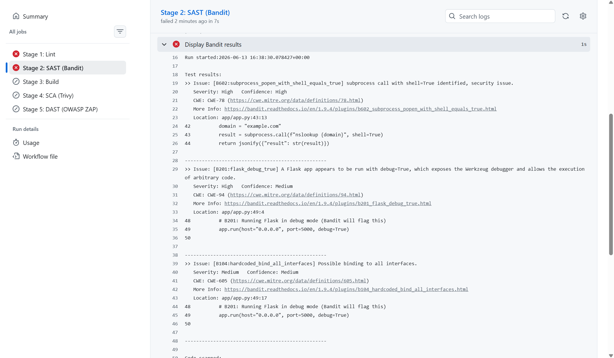
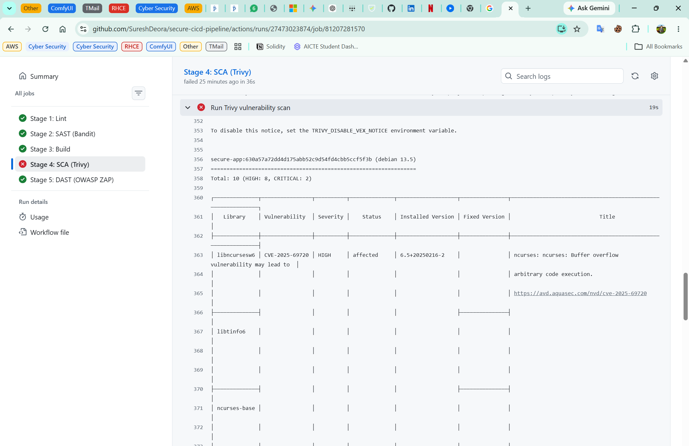
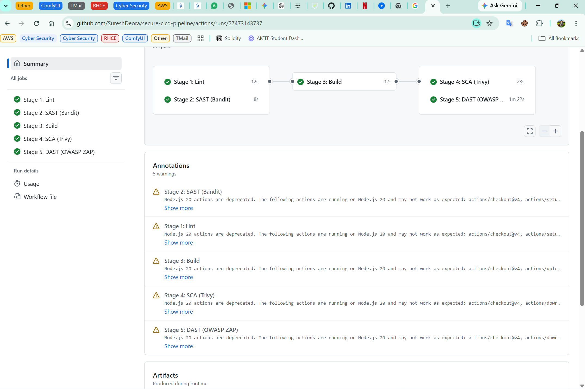

# 🛡️ Secure CI/CD Pipeline (DevSecOps)

A fully automated DevSecOps CI/CD pipeline built with GitHub Actions. This pipeline demonstrates "Shift-Left Security" by integrating multiple security scanners directly into the CI process, automatically blocking deployments that contain critical vulnerabilities.

## 🏗️ Pipeline Architecture

## 🛠️ Security Tools Integrated

| Stage | Security Tool | Purpose | Fails Pipeline If... |
|---|---|---|---|
| **Linting** | `hadolint`, `flake8` | Dockerfile and Python best practices | Bad formatting, missing cache flags |
| **SAST** | `Bandit` | Static code analysis for Python | Hardcoded secrets, shell injections |
| **SCA** | `Trivy` | Container and dependency scanning | HIGH or CRITICAL CVEs found in base image or libraries |
| **DAST** | `OWASP ZAP` | Dynamic web vulnerability scanning | Missing security headers, exposed endpoints |

---

## 🛑 Security Gate Demonstration

To prove the pipeline works, I intentionally committed vulnerable code and a vulnerable base image. The pipeline successfully caught the issues and blocked the deployment.

### 1. The Blocked Pipeline (Vulnerabilities Caught)

*The pipeline failing at Stage 2 (Bandit) due to a hardcoded password and shell injection risk, and Stage 4 (Trivy) due to CVEs in the Debian base image.*

### 2. The Remediation

To fix the pipeline, I implemented the following security remediations:
- **Bandit (SAST):** Removed the hardcoded password (switched to env variables) and replaced unsafe `subprocess.call(shell=True)` with secure alternatives.
- **Trivy (SCA):** Swapped the vulnerable `python:3.11-slim` base image for the hardened, minimal `python:3.12-alpine` image, dropping CVEs to zero.
- **Hadolint:** Added `--no-cache-dir` to Docker pip installs to prevent cache poisoning.

### 3. The Passing Pipeline (Secure)

*After remediating the code and Dockerfile, all 5 security gates pass successfully.*

---

## 🚀 How to Use

1. Clone the repository
2. Push a change to the `main` branch
3. Navigate to the **Actions** tab in GitHub to watch the security scanners run in real-time
4. If the pipeline passes, download the `bandit-report` and `trivy-report` artifacts for detailed security logs.

## 👨‍💻 Author

**Suresh Deora**  
Cybersecurity | DevSecOps | RHCE & RHCSA Certified
